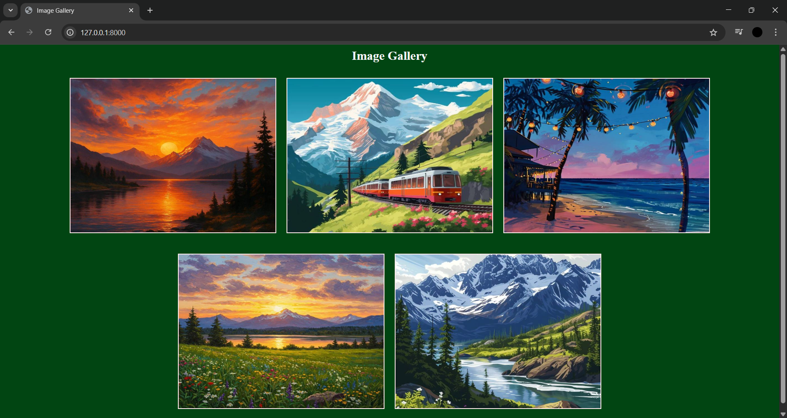
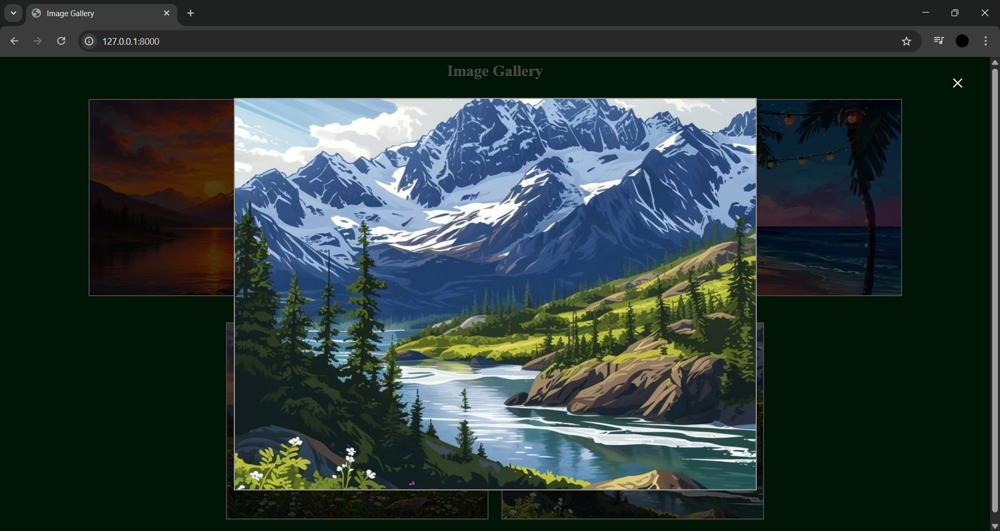
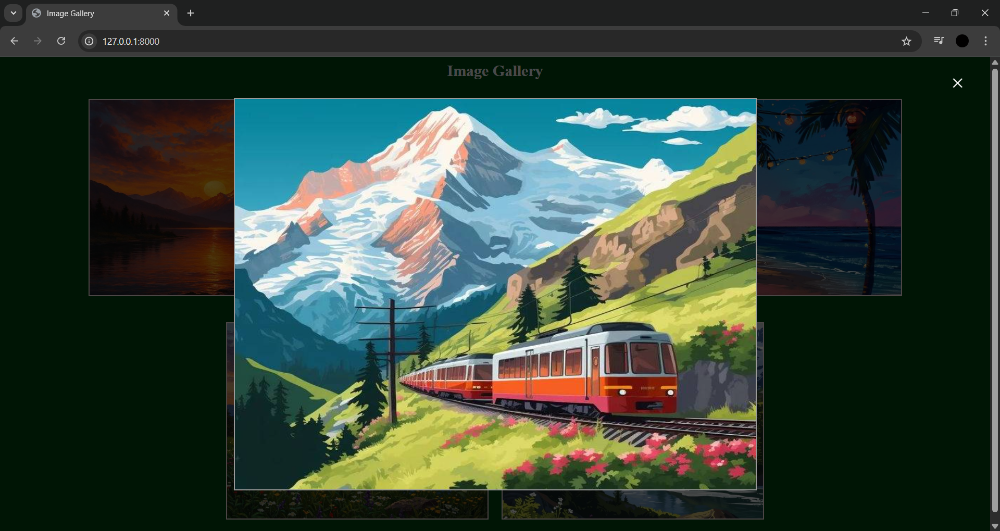

# Ex.06 Design of Interactive Image Gallery
# Date:15-12-25
# AIM:
To design a web application for an inteactive image gallery with minimum five images.

# DESIGN STEPS:
## Step 1:
Clone the github repository and create Django admin interface.

## Step 2:
Change settings.py file to allow request from all hosts.

## Step 3:
Use CSS for positioning and styling.

## Step 4:
Write JavaScript program for implementing interactivity.

## Step 5:
Validate the HTML and CSS code.

## Step 6:
Publish the website in the given URL.

# PROGRAM :
gallery.html
```

<html>
<head>
    <title>Image Gallery</title>
    <link rel="stylesheet" href="">
</head>

<body>
    <center>
<h2>Image Gallery</h2>

<div class="row">
    <div class="img-box">
        
    </div>
    <div class="img-box">
        
    </div>
    <div class="img-box">
        
    </div>
</div>

<div class="row">
    <div class="img-box">
        
    </div>
    <div class="img-box">
        
    </div>
</div>
<div id="popup">
    <span id="close" onclick="closeModal()">&times;</span>
    
</div>

<script>
function openImage(img){
    const modal = document.getElementById("popup");
    const modalImg = document.getElementById("popupImg");

    modalImg.src = img.src;
    modal.style.display = "flex";
}

function closeModal(){
    document.getElementById("popup").style.display = "none";
}
</script>
</center>
</body>
</html>
```
CSS.css
```
h2{
    color: whitesmoke; 
} 
body{ 
    background-color: rgb(1, 69, 18); 
    text-align: center; 
} 
.row{ 
    display: flex; 
    justify-content: center; 
    margin-bottom: 20px; 
} 
img{ 
    margin: 10px; 
    width: 400px;
    height: 300px;
    border: 2px solid rgb(255, 235, 235); 
    cursor: pointer; 
    transition: transform 0.3s ease;
}

img:hover{ 
    box-shadow: 0px 0px 10px rgb(106, 106, 106); 
    transform: scale(1.2);
} 
.img-box {
    overflow: hidden;
    
}
#popup{
    display: none; 
    position: fixed; 
    top: 0; 
    left: 0; 
    width: 100%; 
    height: 100%; 
    background-color: rgba(0,0,0,0.7); 
    justify-content: center;
    align-items: center; 
} 
#popupImg{ 
    width: 800px; 
    height: 600px; 
    border: 2px solid rgb(154, 154, 154); 
} 
#close{ 
    position: absolute; 
    top: 20px; 
    right: 40px; 
    color: white; 
    font-size: 35px; 
    cursor: pointer; 
}
```
views.py 
```
from django.shortcuts import render

def home(request):
    return render(request, 'gallery.html')
```
urls.py 
```
from django.contrib import admin
from django.urls import path
from photosapp import views

urlpatterns = [
    path('admin/', admin.site.urls),
        path('', views.home),
]

```
# OUTPUT:




# RESULT:
The program for designing an interactive image gallery using HTML, CSS and JavaScript is executed successfully.
